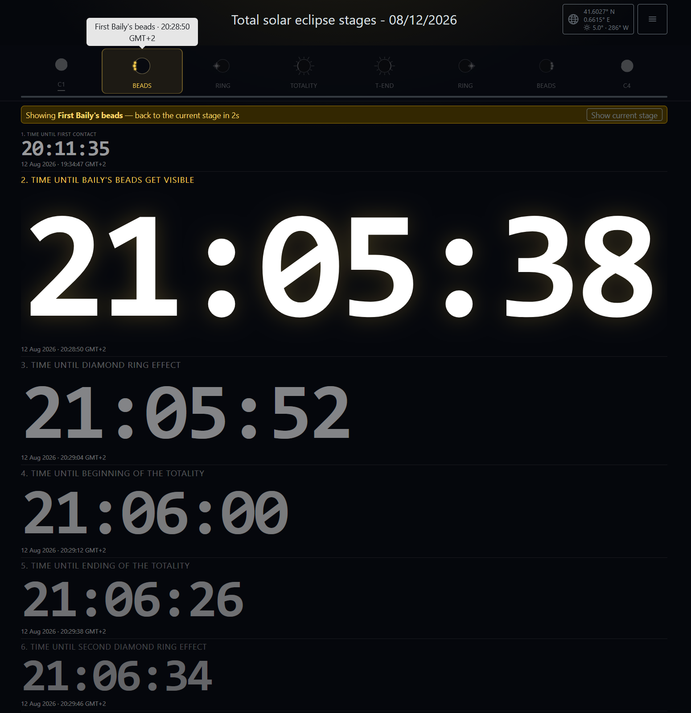
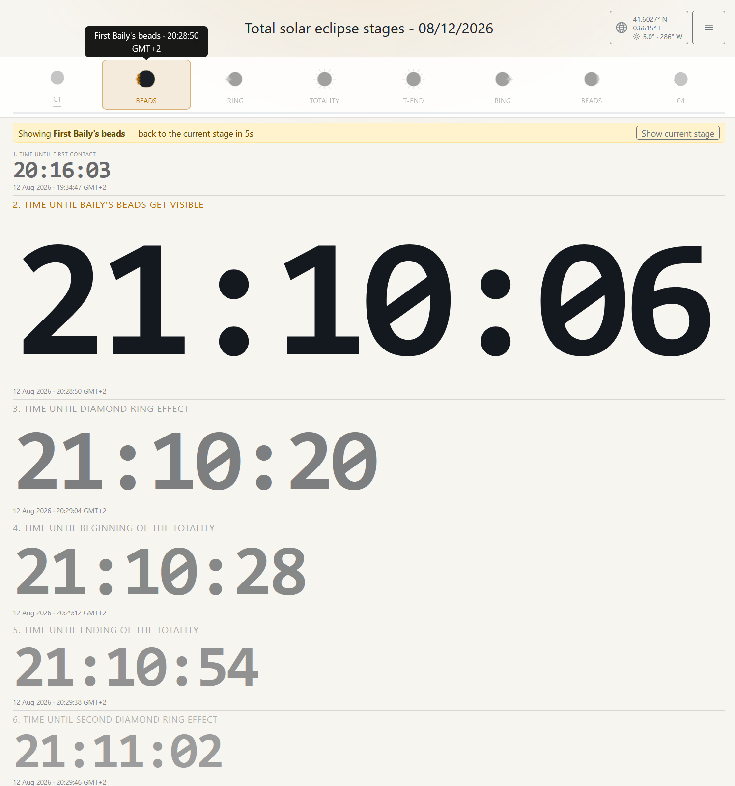
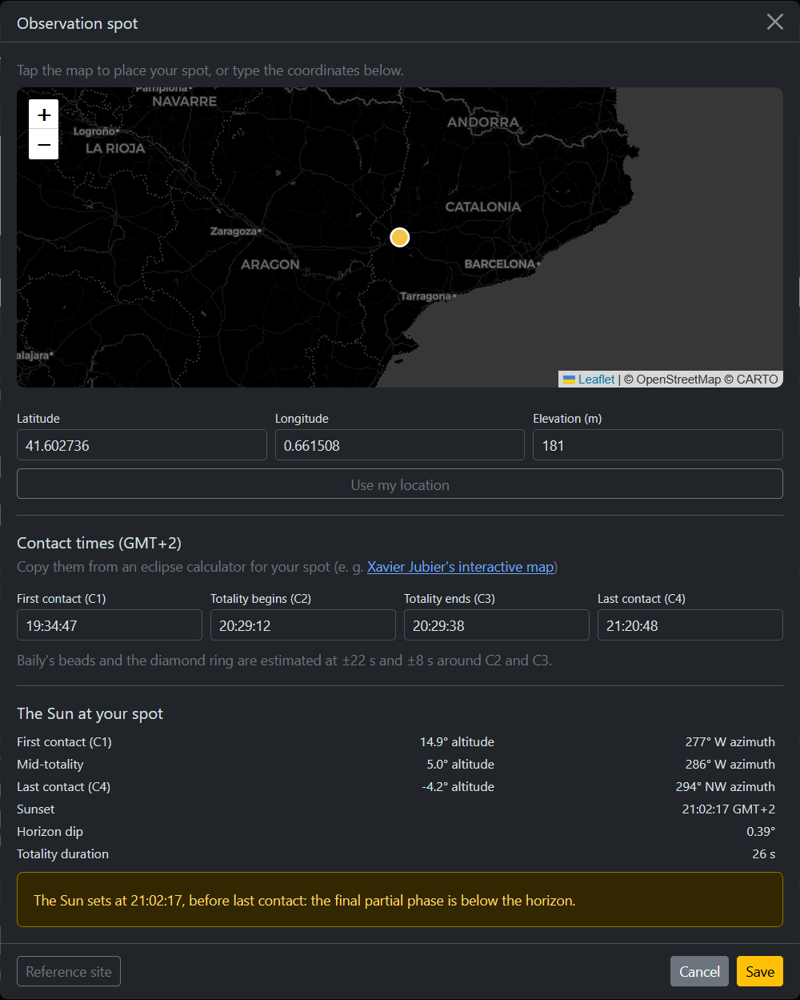
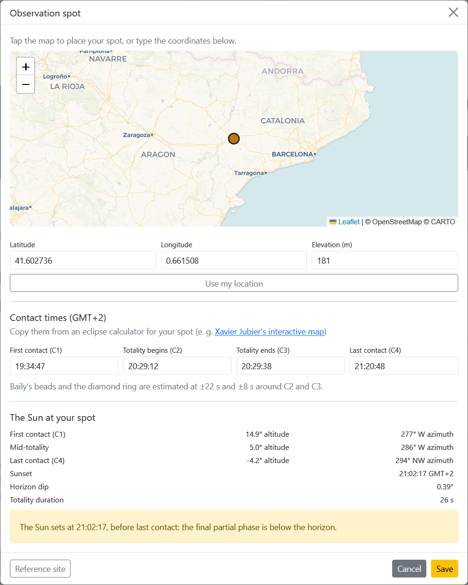

# Total solar eclipse stages — 12 August 2026

A single-page countdown tracker for the eight stages of the total solar eclipse of
12 August 2026. It shows how long is left until each stage at your own observing
site, which stage is current, and where the Sun will be in the sky when totality
arrives — a question that matters for this eclipse, because across Spain it
happens only a few degrees above the western horizon.

Everything lives in one self-contained HTML file. No build step, no framework, no
server-side anything.

---

## Screenshots

| | Dark | Light |
|---|---|---|
| **Main page** |  |  |
| **Observation spot** |  |  |

---

## Technical description

### Architecture

One HTML file, about 1,850 lines, holding markup, styles and script. The script
is a single IIFE in plain ES5-era JavaScript — no transpiler, no bundler, no
package manifest. Two external dependencies:

| Dependency | Version | Delivered by | Loaded |
|---|---|---|---|
| Bootstrap (CSS + JS bundle) | 5.3.3 | jsDelivr | in `<head>` |
| Leaflet | 1.9.4 | cdnjs | lazily, on first open of the map |

Leaflet is injected only when the observation-spot dialog is first opened, with
an 8-second timeout. If it never arrives, the dialog hides the map and falls back
to manual coordinate entry; the countdown itself is never blocked by a failed
network request.

**No browser storage is used.** The whole configuration — coordinates, elevation,
the four contact times and the theme — is encoded in the URL fragment:

```
#lat=41.602736&lon=0.661508&el=181&c1=19:34:47&c2=20:29:12&c3=20:29:38&c4=21:20:48&th=dark
```

A reload restores it, a bookmark preserves it, and a shared link reproduces
someone else's exact setup. `history.replaceState` is wrapped in a `try` so a
sandboxed frame degrades quietly instead of throwing.

### The eclipse stages

| # | Stage | Source |
|---|---|---|
| 1 | First contact (C1) | supplied |
| 2 | First Baily's beads | derived, C2 − 22 s |
| 3 | First diamond ring | derived, C2 − 8 s |
| 4 | Totality begins (C2) | supplied |
| 5 | Totality ends (C3) | supplied |
| 6 | Second diamond ring | derived, C3 + 8 s |
| 7 | Second Baily's beads | derived, C3 + 22 s |
| 8 | Last contact (C4) | supplied |

You supply the four contact times; the four intermediate stages are derived from
them by the `BEAD_S` and `RING_S` constants. The page deliberately does **not**
compute eclipse geometry — see [Accuracy and limitations](#accuracy-and-limitations).

Times are stored as ISO strings carrying an explicit `+02:00` offset, so the
countdowns are correct regardless of the viewer's own time zone.

### Countdown layout

Eight rows in one full-width column, in chronological order. The next upcoming
stage is the *main* row and the rest step down in size and fade.

The main row's font size is **measured, not guessed**: the element is set to
100 px, its rendered width read with `getBoundingClientRect()`, and the size
scaled so the digits fill 98% of the column. Later rows use a fixed scale ladder
(`[1, .52, .42, .35, .30, .26, .23, .21]`), passed stages drop to `0.14`, and a
12 px floor stops anything vanishing.

A soft ceiling caps the main row at half the available height, so a very short
window still shows more than one countdown. Width normally wins, which is what
phone landscape wants.

The fade is applied through `opacity`, never colour, so the ladder works
unchanged in both themes. Re-measurement is cached on a key of *(main index,
column width, digit count, list offset, viewport height)* and recomputed on
resize, orientation change, `visualViewport` resize, language switch and site
change. The clock ticks every 250 ms.

### The icon strip

Eight inline SVG icons, drawn from primitives rather than an icon font, so their
colours are CSS custom properties and they re-tint with the theme instead of
being regenerated. Masked crescents for C1 and C4, a corona with limb beads for
Baily's beads, a corona with one bright bead for the diamond rings, and a corona
with rays for totality. Ingress icons put the remaining sunlight on the left
limb and egress on the right, which is the correct sequence for a
northern-hemisphere view.

The strip is `position: sticky` so it stays available while the list scrolls. The
current icon is full colour and scaled to 1.1; the rest are greyscaled, dimmed
and scaled to 0.9. Scaling is done with `transform`, so the strip never reflows
as stages pass. Tapping any icon promotes its countdown for 10 seconds, with a
banner showing the seconds remaining and a button to return early. A progress bar
under the strip tracks C1 → C4.

### Observation spot and astronomy

The header button shows latitude, longitude and the Sun's altitude and azimuth at
mid-totality, with a warning badge when the Sun is low or below the horizon. The
dialog behind it offers a Leaflet map (tap to place a pin), manual lat/lon/
elevation fields, a geolocation button that also reads device altitude when
reported, and the four contact-time fields with `HH:MM:SS` parsing and an
ordering check.

Text inputs are used for the times rather than `<input type="time">`, because the
workflow is pasting from an eclipse calculator and native time pickers handle
paste badly and drop seconds on iOS.

Computed live as you type:

- **Solar altitude and azimuth** at C1, mid-totality and C4, from the algorithm
  in Meeus, *Astronomical Algorithms*, ch. 25 — apparent solar longitude,
  obliquity with the nutation term, GMST, hour angle, then altitude and azimuth.
- **Atmospheric refraction**, Sæmundsson's true-to-apparent formula
  `R = 1.02 / tan(h + 10.3/(h + 5.11))` arcminutes.
- **Horizon dip** from observer elevation, `0.0293° × √h(m)` — about 0.39° at
  181 m, which is not negligible when the Sun is 5° up.
- **Sunset**, by bisection on apparent altitude + dip = 0.
- **Totality duration**, and a warning when C4 falls after sunset.

Two independent checks on the solar code: noon at Greenwich on the equinox
returns 38.50° against a geometric expectation of 38.52°, and noon at the equator
on the solstice returns 66.57° against 66.56°.

### Base maps

| Theme | Tiles | Notes |
|---|---|---|
| Dark | CARTO `dark_all` | brightened before contrast is raised |
| Light | CARTO Voyager | full-colour OSM-derived style |
| Fallback | OpenStreetMap | used if a CARTO source fails |

CARTO's dark style is deliberately muted for use behind data, so it gets
`brightness(1.75) contrast(1.18) saturate(1.25)`, applied to the tile pane so it
composites once. The order matters: CSS `contrast()` pivots on mid-grey, so
raising contrast on dark tiles first would drive them toward black. The filter is
exposed as a `--map-filter` custom property for tuning, and is bound to the tile
*source* rather than the theme, so a pale fallback is never blown out.

OpenStreetMap's own servers reject requests without a `Referer` header — which is
what happens inside a sandboxed frame or over `file://` — so OSM sits last in
each chain rather than first. Each appearance advances within its own source list
on `tileerror`, so a tile failure changes the source without overriding the
user's choice.

### Themes

Two palettes over 22 CSS custom properties, switched by `data-bs-theme` on the
root element, with three modes cycling on one button: **System → Light → Dark**.
System follows `prefers-color-scheme` live.

Dark is the default on purpose: a bright screen wrecks your dark adaptation in
the minutes before totality.

The accent shifts with the theme — `#ffcf4d` on dark, `#b96f00` on light, because
gold on a pale ground has almost no contrast.

### Internationalisation

Catalan, Spanish, English and French: **244 translated strings**, 39 UI keys per
language. On load, `navigator.languages` is walked in order and each tag reduced
to its primary subtag, so `ca-ES`, `ca-valencia`, `es-MX`, `en-GB` and `fr-CA`
all resolve; unmatched locales fall back to English.

Localised beyond the obvious text:

- **Compass points** — west is `W` in English but `O` in all three Romance
  languages, and the same table supplies coordinate hemisphere letters.
- **Numeric date order** — `08/12/2026` in English, `12/08/2026` elsewhere, since
  the former reads as 8 December in Catalan, Spanish and French.
- **Day unit** in the countdown — `2d` versus `2j` for French *jours*.
- `aria-label`, `title` and `<html lang>`.

### Layout and responsiveness

- The header stacks the title above the controls in portrait below 992 px, or at
  any orientation below 700 px, where a single row cannot hold both.
- The spot dialog goes fullscreen on phones. In landscape (≥ 760 px wide and
  ≤ 560 px tall) it becomes two columns, map beside form, which fits without
  scrolling at 844 × 390.
- Dialog inputs are 16 px below 768 px, because iOS Safari zooms the page when a
  focused field is smaller.
- Short viewports hide the per-row target time and tighten padding to give the
  digits room.
- `prefers-reduced-motion` suppresses the icon transitions.
- Tooltips are attached only on `(hover: hover)` devices, where they don't
  compete with tap-to-preview.

The slide-out menu is a Bootstrap **offcanvas** rather than a dropdown, and this
is deliberate: the sticky strip sits at `z-index: 1020` with a `backdrop-filter`,
which makes it a stacking context above Bootstrap's `1000` for dropdown menus — a
dropdown opening there is painted behind a blurred panel and appears not to open
at all. Offcanvas is `1045`. Menu entries also close the panel *first* and open
their dialog from `hidden.bs.offcanvas`, so two backdrops never stack.

### Reference site

The file ships configured for 41° 36′ 09.85″ N, 0° 39′ 41.43″ E, 181 m — the
Segrià, near Lleida.

| | |
|---|---|
| C1 | 19:34:47 GMT+2 |
| C2 | 20:29:12 GMT+2 |
| C3 | 20:29:38 GMT+2 |
| C4 | 21:20:48 GMT+2 |
| Totality | 26 s |
| Sun at mid-totality | 5.0° altitude, azimuth 285° |
| Sunset (from 181 m) | 21:02:17 GMT+2 |

Note the last two rows together: **sunset precedes C4 by about 18 minutes**, so
the final partial phase happens below the horizon. That is not an error in the
data — calculators publish geometric circumstances regardless of visibility — but
it is worth knowing before you wait for last contact.

### Accuracy and limitations

- **Contact times are supplied, not computed.** Deriving them requires the
  eclipse's Besselian elements and an iterative solve for local circumstances.
  Rather than ship approximated elements that would produce confident but wrong
  times, the page asks you for figures from a real calculator.
- **The beads and diamond-ring offsets are fixed constants**, and they are the
  weakest numbers here. In reality the beads phase scales as roughly
  `(P² − D²)/D` in the partial and totality durations, so it lengthens sharply
  near the edge of the path. At the 26-second totality of the reference site the
  two beads phases nearly touch, and ±22 s / ±8 s is a poor model. Beyond that,
  the true timing depends on which lunar valleys sit at the point of tangency —
  Kaguya/LRO topography, not a closed form.
- **All times are GMT+2**, hardcoded in the parser and the labels.
- **The site is assumed to be inside the path of totality**; a partial-only
  location has no C2 or C3, and the validator requires four ascending times.
- Solar position is good to a fraction of a degree — ample for judging a western
  skyline, not intended for pointing instruments.

### Running it

Open the HTML file in a browser; there is nothing to install or compile. For
GitHub Pages, the file needs to be `index.html` in the published root, alongside
`LICENSE.md`.

Requires a current browser: CSS custom properties, `clamp()`, grid,
`backdrop-filter`, `Promise` and `matchMedia`. Clipboard copy in the Share dialog
needs a secure context, which HTTPS hosting provides.

---

## Credits

- [Xavier Jubier's interactive map](http://xjubier.free.fr/en/site_pages/solar_eclipses/TSE_2026_GoogleMapFull.html) — where the contact times come from
- [Bootstrap](https://getbootstrap.com/) — layout, dialogs, offcanvas, form controls
- [Bootstrap Icons](https://icons.getbootstrap.com/) — the GitHub mark and the licence glyph
- [Leaflet](https://leafletjs.com/) — the map in the observation-spot picker
- [OpenStreetMap](https://www.openstreetmap.org/copyright) — map data, and the fallback tile source
- [CARTO](https://carto.com/) — the dark and Voyager basemap tiles
- [jsDelivr](https://www.jsdelivr.com/) — serves Bootstrap
- [cdnjs](https://cdnjs.com/) — serves Leaflet

The solar position and refraction routines follow Jean Meeus, *Astronomical
Algorithms*, and Þorsteinn Sæmundsson's refraction formula.

---

## License

Released under the MIT License. See [LICENSE.md](LICENSE.md).

Copyright © 2026 Ramon Brescó
